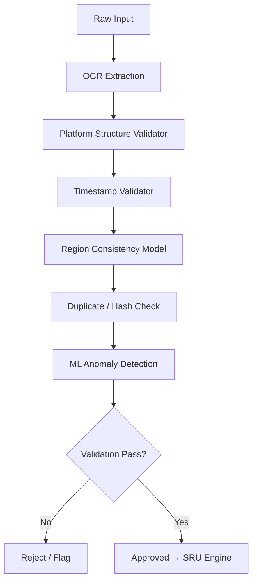
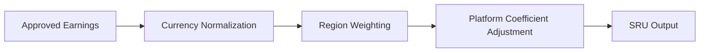
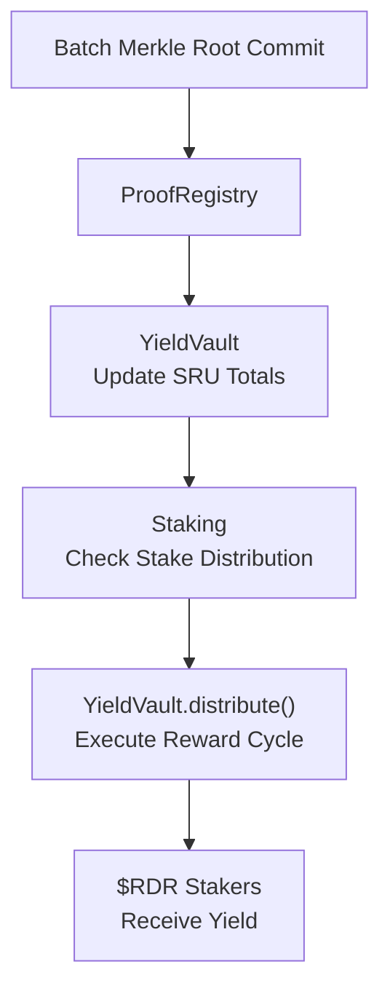
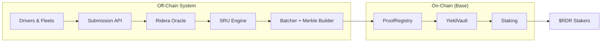

# Ridera Data Flow Architecture
### (Global Mobility → Oracle → SRU → Vault → Stakers)

This document explains the complete Ridera pipeline from proof ingestion to on-chain yield distribution.  
It includes full diagrams in **Mermaid (GitHub native)** and **ASCII** formats for maximum compatibility.

---

# 1. High-Level Overview

Ridera processes global mobility earnings through four major layers:

1. Submission Layer  
2. Verification Layer (Oracle)  
3. Standardization Layer (SRU Engine)  
4. On-Chain Settlement Layer (Base)

---

# 2. High-Level Pipeline Diagram (Mermaid)

```mermaid
flowchart LR
    A["Driver / Fleet\nSubmit Earnings"]
        --> B["Submission Layer\n(images, PDFs, logs)"]

    B --> C["Ridera Oracle\nOCR + ML + Rules"]
    C --> D["Validation Outcome\nValid / Flagged"]
    D --> E["SRU Engine\nNormalization + Weighting"]
    E --> F["SRU Batch Builder"]
    F --> G["Batch Merkle Tree\nRoot Generation"]
    G --> H["On-Chain Commit\nProofRegistry (Base)"]
    H --> I["Yield Vault\nSRU Accounting"]
    I --> J["Staking & Rewards\n$RDR Distribution"]
```



---

# 3. Quick ASCII Overview (for docs that don't render diagrams)

```
Driver/Fleet
     |
     v
[ Submission Portal ]
     |
     v
[ Ridera Oracle ]
     |
  Validated?
   /     \
 No       Yes
 |         |
Rejected   v
        [ SRU Engine ]
             |
             v
     [ SRU Batch & Merkle Root ]
             |
             v
      Commit Root on Base
             |
             v
      [ Yield Vault ]
             |
             v
        $RDR Stakers
```

---

# 4. Submission Layer

Workers submit earnings via:

- Screenshots  
- PDF payout statements  
- Multi-platform bundles (Uber, DoorDash, Grab…)  
- Weekly logs  
- Fleet bulk submissions  

Submission metadata includes region, platform, currency, timestamps, device data, and optional GPS hash.

The data flows:

`Front-end → Backend API → Oracle Queue`

---

# 5. Oracle Verification Pipeline

This is the core validation engine.

### Mermaid (error-free version)



---

# 6. Detailed ASCII Version (Full Oracle Pipeline)

```
+---------------------------+
|   RAW INPUT RECEIVED      |
+---------------------------+
             |
             v
+---------------------------+
|   OCR TEXT EXTRACTION     |
+---------------------------+
             |
             v
+---------------------------+
| PLATFORM STRUCTURE MATCH |
+---------------------------+
             |
             v
+---------------------------+
|  TIMESTAMP VERIFICATION   |
+---------------------------+
             |
             v
+---------------------------+
| REGION CONSISTENCY CHECK |
+---------------------------+
             |
             v
+---------------------------+
|  DUPLICATE / HASH CHECK  |
+---------------------------+
             |
             v
+---------------------------+
| ML ANOMALY ANALYSIS      |
+---------------------------+
             |
             v
+---------------------------+
| PASSED?  |  FAILED?      |
+---------------------------+
      |            |
      v            v
[ SRU ENGINE ]   [ FLAGGED ]
```

---

# 7. SRU Engine Flow

The SRU Engine converts approved earnings into **Standardized Revenue Units (SRU)** using:

- Currency normalization  
- Region weights  
- Platform coefficients  
- Volatility adjustments  

### Mermaid (error-free version)



---

# 8. SRU Batching & Merkle Tree Creation

```
[ SRU Outputs ]
       |
       v
[ Group by Region / Platform / Cycle ]
       |
       v
[ Build Merkle Tree ]
       |
       v
[ Generate Merkle Root ]
       |
       v
[ Commit Root to Base ]
```

---

# 9. On-Chain Settlement (Base)

The Base contracts:

- **ProofRegistry** — Stores Merkle roots & metadata  
- **YieldVault** — Aggregates SRUs and generates yield cycles  
- **Staking** — Tracks $RDR stakes & reward entitlement  
- **ValidatorRegistry** — Manages validator bonding & slashing  

### Mermaid (error-free version)



---

# 10. End-to-End Full System Diagram (Mermaid)

Corrected version with **valid subgraph syntax**:



---

# 11. Summary

The Ridera pipeline is designed for:

- global scale  
- high throughput  
- low gas usage  
- transparent proof verification  
- secure yield distribution  
- multi-platform, multi-region compatibility  

This file should be updated whenever:

- new platforms are added  
- SRU weighting changes  
- Oracle model updates  
- batch structure changes  

---

*Document version: v1.1 — Architecture / Data Flow (Mermaid-Fixed)*

