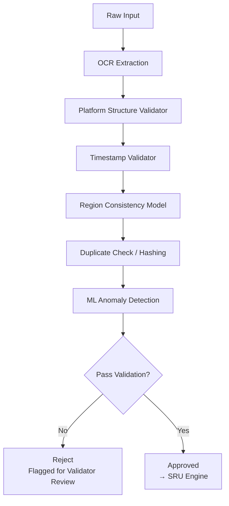
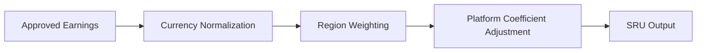

# Ridera Data Flow Architecture  
### (Global Mobility → Oracle → SRU → Vault → Stakers)

This document explains the complete Ridera pipeline from proof ingestion to on-chain yield distribution.  
It includes full diagrams in **Mermaid (GitHub native)** and **ASCII** formats for maximum compatibility.

---

# 1. High-Level Overview

Ridera processes global mobility earnings through four major layers:

1. **Submission Layer**  
2. **Verification Layer (Oracle)**  
3. **Standardization Layer (SRU Engine)**  
4. **On-Chain Settlement Layer (Base)**

Below is the complete high-level flow.

---

# 2. High-Level Pipeline Diagram (Mermaid)

```mermaid
flowchart LR
    A[Driver / Fleet<br>Submit Earnings] --> B[Submission Layer<br>(images, PDFs, logs)]
    B --> C[Ridera Oracle<br>OCR + ML + Rules]
    C --> D[Validation Outcome<br>(Valid / Flagged)]
    D --> E[SRU Engine<br>Normalization + Weighting]
    E --> F[SRU Batch Builder]
    F --> G[Batch Merkle Tree<br>Root Generation]
    G --> H[On-Chain Commit<br>ProofRegistry on Base]
    H --> I[Yield Vault<br>SRU Accounting]
    I --> J[Staking & Rewards<br>$RDR Distribution]
```

---

# 3. Quick ASCII Overview (for docs that don't render diagrams)

```
Driver/Fleet
     |
     v
[ Submission Portal ]
     |
     v
[ Ridera Oracle ]
     |
  Validated?
   /     \
 No       Yes
 |         |
Rejected   v
        [ SRU Engine ]
             |
             v
     [ SRU Batch & Merkle Root ]
             |
             v
      Commit Root on Base
             |
             v
      [ Yield Vault ]
             |
             v
        $RDR Stakers
```

---

# 4. Submission Layer

Workers submit earnings via:

- Screenshots  
- PDF payout statements  
- Multi-platform bundles (Uber + DoorDash + Grab)  
- Weekly logs  
- Fleet bulk submissions  

Submission metadata includes:

- region tag  
- platform ID  
- currency  
- timestamps  
- device metadata  
- optional GPS hash  

Front-end → backend → Oracle queue.

---

# 5. Oracle Verification Pipeline

This is the core validation engine.

Below is the step-by-step verification flow using Mermaid.



---

# 6. Detailed ASCII Version (Full Oracle Pipeline)

```
+---------------------------+
|   RAW INPUT RECEIVED      |
+---------------------------+
             |
             v
+---------------------------+
|   OCR TEXT EXTRACTION     |
+---------------------------+
             |
             v
+---------------------------+
| PLATFORM STRUCTURE MATCH |
+---------------------------+
             |
             v
+---------------------------+
|  TIMESTAMP VERIFICATION   |
+---------------------------+
             |
             v
+---------------------------+
| REGION CONSISTENCY CHECK |
+---------------------------+
             |
             v
+---------------------------+
|  DUPLICATE / HASH CHECK  |
+---------------------------+
             |
             v
+---------------------------+
| ML ANOMALY ANALYSIS      |
+---------------------------+
             |
             v
+---------------------------+
| PASSED?  |  FAILED?      |
+---------------------------+
      |            |
      v            v
[ SRU ENGINE ]   [ FLAGGED ]
```

---

# 7. SRU Engine Flow

The SRU Engine converts approved earnings into **Standardized Revenue Units** using:

- currency normalization  
- region weights  
- platform coefficients  
- volatility adjustments  

### SRU Calculation Flow (Mermaid)



---

# 8. SRU Batching & Merkle Tree Creation

Once SRUs are generated, Ridera groups them into batches.

### Batch Flow Diagram (ASCII)

```
[ SRU Outputs ]
       |
       v
[ Group by Region / Platform / Cycle ]
       |
       v
[ Build Merkle Tree ]
       |
       v
[ Generate Merkle Root ]
       |
       v
[ Commit Root to Base ]
```

---

# 9. On-Chain Settlement (Base)

The following contracts live on Base:

- **ProofRegistry**  
  Stores Merkle roots and SRU metadata.

- **YieldVault**  
  Aggregates SRUs and calculates yield cycles.

- **Staking**  
  Tracks $RDR stakes and reward allocation.

- **ValidatorRegistry**  
  Handles validator bonding & slashing.

### Mermaid Diagram (complete on-chain flow)

```mermaid
flowchart TD
    A[Batch Merkle Root<br>Commit] --> B[ProofRegistry]
    B --> C[YieldVault<br>Update SRU Totals]
    C --> D[Staking<br>Check Stake Distribution]
    D --> E[YieldVault.distribute()<br>Reward Cycle]
    E --> F[$RDR Stakers<br>Receive Yield]
```

---

# 10. End-to-End Full System Diagram (Mermaid)

```mermaid
flowchart LR
    subgraph Off-Chain
        A[Drivers & Fleets] --> B[Submission API]
        B --> C[Ridera Oracle]
        C --> D[SRU Engine]
        D --> E[Batcher + Merkle Builder]
    end

    subgraph On-Chain (Base)
        F[ProofRegistry]
        G[YieldVault]
        H[Staking]
    end

    E --> F
    F --> G
    G --> H
    H --> J[$RDR Stakers]
```

---

# 11. Summary

The Ridera pipeline is designed for:

- global scale  
- high throughput  
- low gas usage  
- transparent proof verification  
- secure yield distribution  
- multi-platform, multi-region compatibility  

This file should be updated whenever:

- new platforms are added  
- SRU weighting changes  
- Oracle version updates  
- batch structure changes  

---

*Document version: v1.0 — Architecture / Data Flow*  
