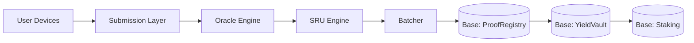

# Ridera Protocol Overview  
### Global Mobility → Verified Proofs → Standardized Revenue → On-Chain Yield (Base)

This document provides a complete technical overview of the Ridera Protocol, including system components, trust boundaries, off-chain vs on-chain workflow, and the economic model that powers Ridera’s Mobility RWA framework.

It is intended for developers, auditors, integration partners, and contributors.

---

# 1. Protocol Purpose

Ridera converts global mobility earnings (from Uber, Lyft, DoorDash, Grab, Rappi, etc.) into **verifiable**, **standardized**, and **on-chain** value.

The protocol solves three fundamental problems:

1. **Global mobility income cannot be verified easily.**  
2. **Earnings are fragmented across apps, regions, and currencies.**  
3. **No on-chain system fairly represents mobility income.**

Ridera introduces:

- a global verification Oracle  
- a standardized metric (SRU)  
- a decentralized yield vault  
- validator-governance  
- a transparent and scalable RWA model  

---

# 2. Core Architecture Layers

The Ridera protocol consists of **four layers**:

### **1. Submission Layer (Off-chain)**
Receives earnings from drivers and fleets.

### **2. Verification Layer — Ridera Oracle (Off-chain)**
Parses, validates, and authenticates income proofs.

### **3. Standardization Layer — SRU Engine (Off-chain)**
Normalizes earnings into a global mobility unit (SRU).

### **4. Settlement Layer (On-Chain, Base)**
Anchors proofs, updates SRU totals, runs yield cycles, and distributes $RDR rewards.

---

# 3. System Modules Breakdown

Below are the **8 core modules** powering Ridera.

---

## **3.1 Submission Module**

Handles all incoming proofs.

Functions:
- input validation  
- file parsing  
- metadata extraction  
- request queuing  

Supports:
- Screenshots  
- PDFs  
- Platform payout logs  
- Fleet bulk uploads  

---

## **3.2 Oracle Module (Verification Engine)**

Ensures all proof submissions are:
- real  
- accurate  
- non-duplicated  
- platform-consistent  

Oracle Components:
- OCR Engine  
- Platform Structure Validator  
- Timestamp Validator  
- Region-weight anomaly model  
- Duplicate & hash-check system  
- ML anomaly detection  
- Validator routing (for flagged entries)

Outputs:
- approved earnings  
- flagged earnings  
- rejected submissions  
- trust-score updates  

---

## **3.3 SRU Engine (Standardization Layer)**

Transforms validated earnings into **Standardized Revenue Units**.

Inputs:
- validated earnings  
- currency data  
- region multipliers  
- platform coefficients  

Outputs:
- SRU values  
- SRU metadata  
- SRU batch entries  

---

## **3.4 Batcher & Merkle Generator**

Bundles SRUs for efficient on-chain commitment.

Functions:
- aggregate SRUs  
- group by time/region/platform  
- build Merkle trees  
- generate Merkle roots  
- prepare batch metadata  

Merkle root = immutable representation of hundreds or thousands of SRUs.

---

## **3.5 On-Chain Proof Registry (Base)**

Minimal storage contract responsible for:
- storing Merkle roots  
- storing batch metadata  
- exposing batch IDs for verification  
- enabling off-chain inclusion proof checks  

Ensures fully transparent SRU proofs.

---

## **3.6 Yield Vault (On-Chain)**

The core financial engine of Ridera.

Responsibilities:
- aggregate SRU totals  
- compute yield cycles  
- distribute rewards to stakers  
- update accounting  
- provide public logs  

Yield is backed **exclusively by real mobility earnings**.

---

## **3.7 Staking Contract (On-Chain)**

Tracks:
- $RDR stake balances  
- eligibility for yield cycles  
- lock periods  
- early withdrawal rules  

Rewards are distributed according to the user’s stake share.

---

## **3.8 Validator Registry (On-Chain)**

Controls validator behavior.

Includes:
- validator bonding  
- slashing rules  
- audit responsibilities  
- trust scoring  

Validators operate both:
- **off-chain** (reviewing proofs)
- **on-chain** (bonding, governance voting)

---

# 4. End-to-End Protocol Flow

Below is the **complete lifecycle** of a submission:

```
SUBMISSION → ORACLE → SRU ENGINE → BATCHER → BASE (PROOF REGISTRY) → YIELD VAULT → STAKERS
```

Detailed flow:

1. **Driver uploads proof**  
2. Oracle verifies authenticity  
3. Oracle passes approved earnings to SRU Engine  
4. SRU Engine converts earnings → SRU  
5. Batcher groups SRUs and builds Merkle tree  
6. Merkle root submitted to Base  
7. ProofRegistry stores root  
8. YieldVault updates totals  
9. At cycle end → YieldVault distributes rewards  
10. Stakers receive $RDR yield  

---

# 5. Trust Boundary Diagram (Mermaid)



---

# 6. Off-Chain vs On-Chain Responsibilities

| Component | Off-Chain | On-Chain (Base) |
|----------|-----------|------------------|
| Submission Portal | ✔ | ❌ |
| Oracle | ✔ | ❌ |
| SRU Engine | ✔ | ❌ |
| Batcher | ✔ | ❌ |
| Proof Registry | ❌ | ✔ |
| Yield Vault | ❌ | ✔ |
| Staking | ❌ | ✔ |
| Validator Registry | ❌ | ✔ |
| Transparency Dashboard | ✔ | ❌ |

---

# 7. Protocol Guarantees

The Ridera protocol guarantees:

### **1. Verifiability**  
All earnings verifiable through Merkle proofs.

### **2. Transparency**  
Batch metadata and yield cycles are public.

### **3. Non-custodial model**  
Protocol never holds user fiat.

### **4. Global fairness**  
SRU ensures equal representation across regions.

### **5. Security**  
Anchored proofs, slashed validators, multi-layer validation.

---

# 8. Future Upgrade Path

### Oracle v2  
- ML automation  
- language-independent parsing  
- behavior modeling  

### Oracle v3  
- API integrations with mobility platforms  
- automated earnings sync  

### Oracle v4  
- Zero-knowledge earnings validation  

### Yield Vault v2  
- multi-vault pools  
- region-specific pools  

### Governance v1  
- validator-driven governance  
- SRU model proposals  

---

# 9. Summary

The Ridera Protocol is a hybrid off-chain/on-chain system built for scalable, global, and secure tokenization of mobility income.  
By combining rigorous verification, standardized revenue units, and decentralized on-chain yield, Ridera introduces the first global RWA model directly tied to mobility labor — one of the world’s largest and most stable industries.

---

*Document version: v1.0 — Protocol Architecture Overview*
